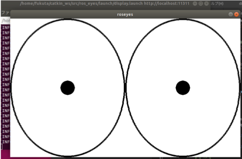

# ros_eyes



## Overview
ros_eyes is developed with reference to **xeyes**. \([xeyes](https://www.x.org/releases/X11R7.5/doc/man/man1/xeyes.1.html) - a follow the mouse X demo\)

The movement of the eye is recognized as the ROS message **"geometry_msgs\/QuaternionStamped"**. Display the result in xwindow.

## Hardware Support
This application runs on "X Window System".

## Getting started
* Install dependent apps.
```bash
$ sudo apt-get install python-pygame
```
* by remote
```bash
$ ssh hoge@fuge.local
$ export DISPLAY=:1 # 1 is a displayID. It depends on the environment.
$ roslaunch ros_eyes display.launch src_topic:=quaternion bg_color:=255,255,255 is_fullscreen:=true
```
* on the machine
```bash
$ roslaunch ros_eyes display.launch src_topic:=quaternion bg_color:=255,255,255 is_fullscreen:=true
```

## Nodes
### ros_eyes
The ros_eyes node takes in "geometry_msgs\/QuaternionStamped" messages and display eyes.

### Subscribed Topics
* quaternion\(geometry_msgs\/QuaternionStamped\)
   - The movement of the eye is recognized as the ROS message "geometry_msgs\/QuaternionStamped"

### Parameters
* ~src_topic
   - default="quaternion"
* ~bg_color
   - default="255,255,255"
   - Specify the background color in RGB (255 levels).
* ~is_fullscreen
   - default="false"
   - If true, make the window size full screen.
* ~hz
   - default="30"
   - Drawing frequency.
* ~width
   - default="800"
   - Resolution for window display.
* ~height
   - default="480"
   - Resolution for window display.
